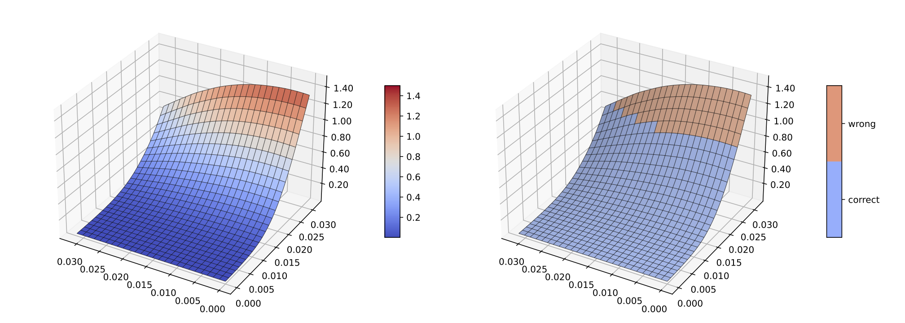
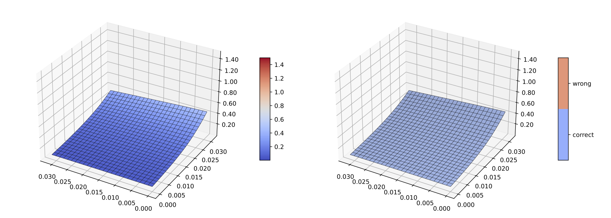

# Quadratic Upper Bound for Adversarial Training (QUB-AT)

Official PyTorch implementation of **"Quadratic Upper Bound for Boosting Robustness"**
[(You et al., ICML 2025)](https://proceedings.mlr.press/v267/you25a.html).

It includes implementations of standard adversarial training and adversarial
training with the proposed Quadratic Upper Bound (QUB) loss, with experiments under both **FGSM** and **PGD** adversarial attacks.

---

## Abstract (Short)
We propose a **Quadratic Upper Bound (QUB)** loss for adversarial training.  
Compared to standard adversarial training objectives, QUB provides a stable surrogate that improves
robustness under common threat models.

---

## Loss Landscape

Loss landscape comparison between standard adversarial training and QUB.

  
  

  Standard AT (left) vs QUB AT (right)

**Training variants included in this repo**
- Standard adversarial training (baseline)
- Adversarial training with **QUB loss**
- Attacks: **FGSM**, **PGD-10** (configurable)
